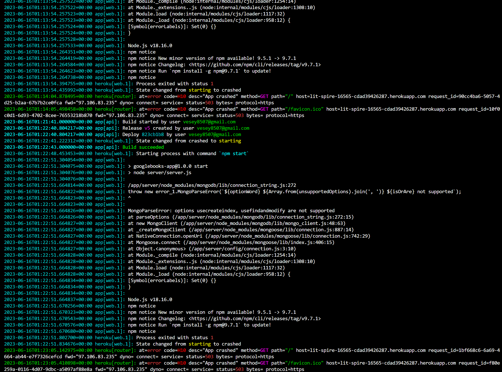

 # Book Search Engine
          
  

  ## Description
  The Book Search Engine application serves the purpose of allowing its users to search and read a little about books they are interested in and considering to buy or rent. A user will be allowed to save books as favorites and be saved to their profile page. 

  EDIT:I WAS ABLE TO DEPLOY IT TO THE LOCALHOST BUT IT FAILED HEROKU. IT SAID THE BUILD WAS SUCCESSFUL BUT  GAVE THIS ERROR.
  https://lit-spire-16565-cdad39426287.herokuapp.com/ 
  
  https://drive.google.com/file/d/1TLB6_1Zf9Pv9INyj-v_dT24gr6gQfk3m/view 
  I am having difficulty loading the client side on to the page. When i run npm run start it loads the link to the localhost but then showed an error in the console log of
   Uncaught SyntaxError: Unexpected token <..... I read this https://idiallo.com/javascript/uncaught-syntaxerror-unexpected-token#n and tried to comment out the html file in the build file, that caused the console log error message to stop but a blank screen just appears now. So I just refactored as best I could.

   References:
   https://arunrajeevan.medium.com/understanding-mongoose-connection-options-2b6e73d96de1 
   

## Table of Contents
  * [Installation](#installation)
  * [Usage](#usage)
  * [License](#license)
  * [Contributing](#contributing)
  * [Tests](#tests)
  * [Questions](#questions)
          
## Installation
  A user must clone this repo then do the following.
  1. Run npm run install
  2. Run npm i
  3. Run npm run start 
  4. Go to localhost:3001 or other assigned location.

## Usage
  The instructions below will inform you how to use this application.
  To properly use this application a user will just enter a book they are interested ininto the search bar and the results will appear in different cards. You will be able to select the book and then find further information about the book. 

## License
  This application uses the MIT license.

## Contributing
  Contributors: 
  I worked on this project alone but if you would like to contribute you can create a fork from my GitHub account and begin your work.

## Tests
  The tests below will show how the application is run.
  

## Questions
  If you have any questions about the application or repository please contact me at 
  https://github.com/CoreyVesey/README Generator or
  vesey8507@gmail.com

